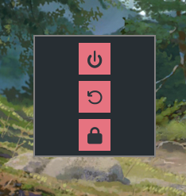

## Power Menu

Simple menu to choose between shutdown, reboot or lock.

- [x] Shutdown
- [x] Reboot
- [-] Lock



### Install

Dependencies: sdl2, sdl2_ttf, make

```git clone https://github.com/rodcabral/power-menu && cd power-menu && make install```
